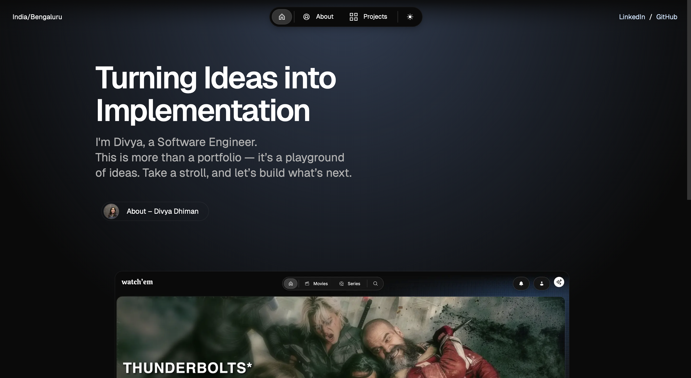

# Portfolio Website

Welcome to my personal portfolio website! This site showcases my work, skills, experience, and blogs. It also serves as a hub for recruiters and collaborators to learn more about me, view my projects, and get in touch.





## Getting Started
Follow these steps to set up and run the project locally.
### Prerequisites
Make sure you have the following installed:

- [Node.js](https://nodejs.org/) (v18 or later)
- [npm](https://www.npmjs.com/) or [Yarn](https://yarnpkg.com/)

### Installation

1. **Clone the repository:**

   ```bash
   git clone https://github.com/your-username/portfolio-website-v3.git
   cd portfolio-website-v3

2. Install dependencies:
   
   ```bash
   npm install
    # or
    yarn install
   ```

### Development

To run the development server with Turbopack:

    ```bash
    npm run dev
    # or
    yarn dev
    ```
The app will be available at http://localhost:3000


## Project Structure

```ruby
.
├── public/                    # Static assets
├── src/
│   ├── app/
│   │   ├── about/             # About route
│   │   ├── api/               # API endpoints
│   │   ├── projects/          # Project route
│   │   └── utils/             # Utility functions
│   ├── components/
│   │   ├── about/             # About section components
│   │   ├── projects/          # Project card & related UI
│   │   ├── Footer.tsx
│   │   ├── Header.tsx
│   │   ├── ThemeToggle.tsx
│   └── layout.tsx            # Root layout
├── resources/
│   └── projectwork/           # Project content in MDX
│       ├── chat-assistant-using-llama...
│       ├── portfolio-website-v1.mdx
│       └── watchem-movie-playlist...
├── next.config.mjs           # Next.js configuration
├── package.json
└── README.md

```

## Author

Made with ❤️ by Divya Dhiman
